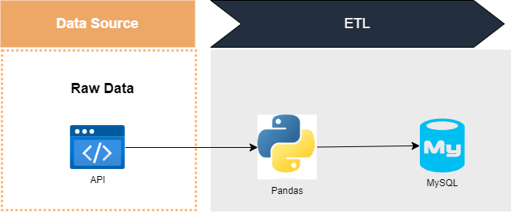

# etl_mysql

The main purpose of this ETL pipeline is to fetch data from API, transform it and then load into MySQL database.

- **Extract**: Pulling data from an external API, specifically fetching a list of universities in the United States.
- **Transform**: Manipulating the extracted data using the pandas library. This includes filtering the data to only include universities in California and converting certain list fields into comma-separated strings.
- **Load**: Saving the transformed data into a MySQL database which is hosted in Amazon RDS.

### Important note**
1. **Amazon RDS set up**: for simplicity, allow public access to MySQL, and set up inbound and outbound rules of Security Group in VPC.
1.1 Inbound & Outbound rules, choose Type = MySQL/Aurora, and set Source = MyIP
2. **MySQL connection**: connection parameters including passowrd should not be hardcoded. Use environment variable. Use .gitignore file to specify .env should not be committed.
3. **Python library**: ensure all necessary libraries are installed
    pip install requests pandas sqlalchemy mysql-connector-python pymysql python-dotenv
