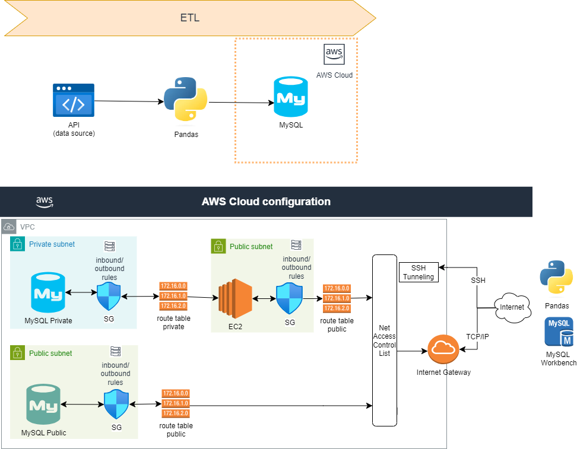
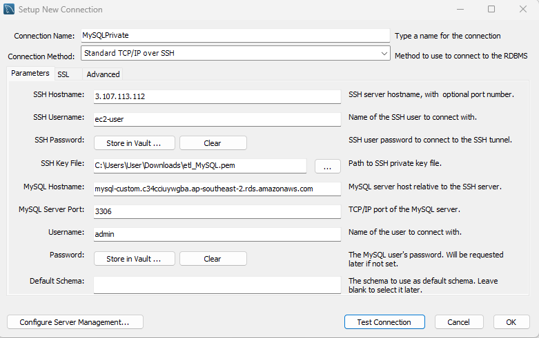

# etl_mysql

## The main purpose 
The main purpose of this ETL pipeline is to fetch data from API, transform it usihng python and then load into a MySQL database hosted on AWS.  
VPC configuration is crucial if MySQL instance is private. This involves setting up a EC2 instance in public subnect, a private RDS in private subnet, and respective security groups inbound and outbound rules. Whether a subnet is public or private, this is purely dependednt on the associated route table. If it does allow route to Destination 0.0.0.0/0 (Target Internet Gateway), the subnect is public. The Net Access Control List and Internet Gateway should also be set up correctly and attached to the VPC. 

- **Extract**: Pulling data from an external API, specifically fetching a list of universities in the United States.
- **Transform**: Manipulating the extracted data using the pandas library. This includes filtering the data to only include universities in California and converting certain list fields into comma-separated strings.
- **Load**: Saving the transformed data into a MySQL database which is hosted in Amazon RDS.

## Important note
### 1. **Amazon RDS set up**:   

**Assuming RDS instance is public accessible**
- Ensure RDS instance is in a public subnet (i.e. associated with a route to the Internet Gateway).
- The "Publicly Accessible" option must be set to "Yes" (it automatically assigned public IP address to the instance).
- The Security Group must allow inbound and outbound traffic on the MySQL port from 'My IP address'
- The NACL must allow both inbound and outbound traffic for the MySQL port and ephemeral ports.  

**Assuming RDS instance is NOT public accessible** 
- Ensure RDS instance is in a private subnet (i.e. does not associated with a route to the Internet Gateway).
- The "Publicly Accessible" option must be set to "No"  
- The Security Group of RDS includes:   
-- Inbound rules:
Allow MySQL (port 3306) from EC2 Security Group  
-- Outbound rules: NULL 
- Set up a public EC2 instance (bastion Host) in a public subnet (associated with a route to the Internet Gateway)
- The Security Group of EC2 includes:  
-- Inbound rules:
Allow SSH (port 22) from 'MyIP' address  
-- Outbound rules:
Allow MySQL (port 3306) to RDS Security Group;

**Note:**  
1. Being "public" means the instance has a public IP and can be reached from the internet, but all incoming traffic is still filtered by the security group rules.
2. Security Group stateful nature: if you allow an inbound connection, the corresponding outbound traffic for that connection is automatically allowed, regardless of the outbound rules. 
3. SSH (Secure Shell) actually uses TCP as its transport protocol, typically on port 22. When allowing SSH in the inbound rule, it's essentially allowing TCP traffic on port 22. Using "SSH" instead of "TCP" in the rule makes it immediately clear what type of traffic is being allowed.

### 2. **Connect to MySQL Database via MySQL Workbench**： 
**Assuming RDS instance is public accessible (has public IP address)**  
click + sign, in the pop up window, select connection method as Standard (TCP/ID).  
Hostname is the Endpoint of RDS instance.

**Assuming RDS instance is NOT public accessible**   
click + sign, in the pop up window, select connection method as Standard TCP/IP over SSH.

SSH Hostname is the Endpoint of EC2 instance   
SSH Username default value: ec2-user
SSH Key File: this is generated by AWS during EC2 creation.
MySQL Hostname is the Endpoint of RDS instance

### 3.Connect to MySQL Database in Python (sqlalchemy library)
**Assuming RDS instance is public accessible**   
Database credentials and connection paramters are contained in .env files.    
To avoid exposing credential, use .gitignore file to specify .env so that .env will not be committed.

**Assuming RDS instance is NOT public accessible**  
Use SSH tunnel to connect local machine (where Python script is running) to the public EC2 instance. The port forwarding is set up to go through this tunnel, beyond the EC2 instance, and directly to the MySQL database.   
A local port on local machine will be forwarded to a remote port on the private MySQL database. This is represented by the remote_bind_address parameter: **remote_bind_address=(mysql_host, int(mysql_port))**   
A port is a communication endpoint in an operating system. Ports allow a single host to run multiple services, each accessible via a unique port number:   
- SSH typically uses port 22
- MySQL typically uses port 3306

Port forwarding is a technique that redirects communication requests from one address and port number combination to another. A local port on local machine (assume it's 3307) is forwarded to the MySQL port (3306) on the private database server, meaning when an application connects to localhost:3307, it's actually connecting to the remote database's port 3306.

Regarding .pem file is generated when you create an EC2 instance. it contains the private key and the corresponding public key (public key is stored on the EC2 instance). 
Ensure the permission on .pem file are correct (read only by owner): ***chmod 400 etl_MySQL.pem***

### 4. Required pacakges
Ensure all necessary libraries are installed     
    **pip install requests pandas sqlalchemy pymysql python-dotenv sshtunnel**
- os for operating system operations
- requests: used for making HTTP requests (GET, POST, etc.) to web services and APIs.
- pandas: used for data manipulation
- sqlalchemy: provides a set of tools for working with databases, including creating database engines.
- pymysql: allows Python to connect to MySQL databases
- python-dotenv: a Python library that reads key-value pairs from a .env file and adds them to environment variables
- sshtunnel: a library to create SSH tunnels.

### 5. Delete RDS and EC2 after project
Don't forget to delete resources