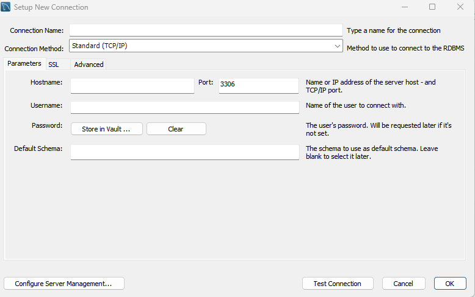

# etl_mysql

The main purpose of this ETL pipeline is to fetch data from API, transform it and then load into MySQL database.

- **Extract**: Pulling data from an external API, specifically fetching a list of universities in the United States.
- **Transform**: Manipulating the extracted data using the pandas library. This includes filtering the data to only include universities in California and converting certain list fields into comma-separated strings.
- **Load**: Saving the transformed data into a MySQL database which is hosted in Amazon RDS.

### Important note
1. **Amazon RDS set up**: for simplicity, allow public access to MySQL, and configure inbound and outbound rules of Security Group in VPC.  
1.1 set Inbound & Outbound rules as follow, Type = MySQL/Aurora, and Source = MyIP  
2. **Connect to MySQL Database via MySQL Workbench**： click + sign, in the pop up window, select Standard TCP. Hostname is the Endpoint of RDS.

3.**Connect to MySQL Database in Python**: use the sqlalchemy library. Database credentials and connection paramters are contained in .env files. To avoid exposing credential, use .gitignore file to specify .env so that .env will not be committed.    
4. **Required pacakges**: ensure all necessary libraries are installed
    pip install requests pandas sqlalchemy pymysql python-dotenv
